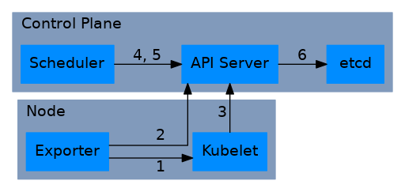

# End-to-end testing for Resource Topology Aware Scheduling

A number of end-to-end tests are needed in order to ensure first that the Resource Topology Aware Scheduling solution works as intended, and secondly that the solution has no unintended side effects on a Kubernetes cluster.

The Resource Topology Aware Scheduling system is made up of five active components from a testing perspective: Kubelet, Topology Exporter, Topology Scheduler, Kubernetes API server and the  etcd database. 

|#  	| Communication		| Motivation				|
|---	|---			|---					|	
|1 	| Exporter -> Kubelet		| Exporter talks to Kubelet to read information about Resource state				|
|2	| Exporter -> API Server	| Exporter talks to the API server to update ResourceTopology Objects				|
|3 	| Kubelet -> API Server		| Kubelet talks to API server to update node info and assign unbound Pods			|
|4	| Topol Scheduler -> API Server	| Topology Scheduler plugin talks to the API server looking for NodeResourceTopology objects	|
|5 	| Scheduler -> API Server	| Scheduler talks to the API server looking for unassigned Pods and Node objects		|
|6	| API Server -> etcd	| API server persists cluster objects to etcd 							| 
 

Three components require changes to an existing Kubernetes cluster as of Kubernetes 1.20:

- **Kubelet** requires changes to expose additional info through the PodResources API.
- **Exporter** is a new component which creates and updates an API object (NodeResourceTopology). This component may in future be part of NPD.
- **Scheduler** a plugin for the Kubernetes scheduler will make scheduling decisions based on NodeResourceTopology. This change may be in tree as part of the core Kubernetes scheduler repo.

## Functional testing 	
Functional testing should show that the Topology Aware Scheduling system performs to spec. Functional testing does not need to be carried out at scale, but should be shown to work on a high-availability cluster with a double-digit number of nodes. 

### Points of failure
In a multicomponent system like Topology Aware Scheduling there are a large number of points at which failure might occur. Each of the points below represents a class of errors that could be triggered in a large number of scenarios. Below is a list of areas that will be the focus of functional testing:

1) Scheduler side effects. Topology Aware Scheduling should have no impact on scheduling of workloads which don't require topology aware scheduling.
2) Out of date information. There may be drift between the topology crd and nodeInfo. 
3) Exporter error. The exporter could fail to  account for resources properly.
4) Scheduler error. The scheduler could choose a node that cannot meet topology constraints.
5) Kubelet misreporting. The kubelet could report the wrong resources at its end point.
6) Kubelet unavailable. The kubelet's information may not be available at the PodResources endpoint.
7) Scheduler unavailable. The Topology Scheduler may be unavailable to the cluster.
8) Exporter error. The exporter could crash leading to no updates for one or more nodes.

### Test cases

| # | Test target 	| Component | Failure state	 		| 		 	|
|---|-------------------|-----------|-----------------------------------|-------------------------------|
| 1 | |  |	  	| 		|
| 2 | |  |  		| 		|
| 3 | |  | 		|  		|
| 4 | |  | 		| 		|
| 5 | |  |	   	|  		|

## Performance testing

### Points of failure
Points of failure for performance testing are different from those in a purely functional test. Initially the performance tests will look for two kinds of failures:
1) Latency should be recorded for multiple different scales and levels of activity. Latency for the differenct components - scheduler, api server etc. may be a limiting factor on scaling of Topology Aware Scheduling.
2) Overload, where the system starts to show errors when utilization is high, should also be tested at scale. The major types of error, the distribution of errors and the scale at which those errors occur will be the backbone of overload testing.

### Test cases
### Frameworks for performance testing at scale
In order to test cluster sizes of up to 5000 nodes simulation of some cluster nodes are needed. Testing is to be carried out with a High Availability control plane of 3 bare metal nodes. In future a set up with 3 Control Plane nodes and an external HA etcd cluster will be considered. Cloud providers do not in general offer instances with multiple NUMA zones, meaning that this type of test will have to be carried out in an on-prem environment.

Scales used for testing:
**Toy:** 10 Nodes
**Small:** 100 Nodes
**Medium:** 500 Nodes
**Large:** 1000 Nodes
**Huge:** 5000 Nodes

The following options are under consideration for end to end testing at scale:

#### 1) VMs
It is relatively easy to create a virtual machine that acts as a "real" Kubernetes node and this is common practice in production Kubernetes. It is also possible to create virtual machines that use resources across NUMA zones i.e. each VM with 4 cpus, two from each NUMA zone. The tradeoff here is between number of nodes and amount of schedulable resources on a node. 

Additional orchestration will also be needed in order to bring up a large number of virtual machines in a bare-metal environment. This additional overhead is likely to make end to end testing using virtual machines the most labor-intensive option, and the one that is least likely to be easily shareable across the community. 

#### 2) Kubernetes in Docker
This solution is similar to VMs but will be more easily shareable with the community and simpler to orchestrate. Docker containers will be able to be created as Kubelets with cross-numa resource allocations meaning that Topology Manager and the scheduling solution will be deployable on this kind of cluster. Similar to the VM solution there is a real resource constraint to this approach where the number of nodes is inversely proportional to the number of pod resource requests that can be fulfilled for each cluster size. 

#### 3) Kubemark
By mocking a fake Kubelet Kubemark is able to create hundreds or thousands of nodes in a cluster while using very few resources. Unfortunately no workloads can be really scheduled to a Kubemark node as it is enitrely mocked. Setting up an on-prem Kubemark cluster is straightforward and sticking to the general limit of 100 pods per cluster, a relatively large cluster can be created using very few machines.

The downside of this approach is that it's really only suitable for testing components inside the Kubernetes control plane. For Resource Topology Scheduling the node-level aspects of the solution would have to be mocked. This would require creation of a mock resource topology exporter with configurable updates. The mock version of the exporter would create a new go routine and client for each node in the cluster and update the resource topology object based on either a timed or event based loop. This approach will not touch the real components and may differ in implementation enough to reduce its overall value as a test.

Additionally there is an opportunity to mock device manager and topology manager inside the fake Kubelet running inside the kubemark hollow node. This would allow the performance of the scheduling solution to be tested across a large number of nodes with failures marked by TopologyAffinityErrors as in a "real cluster". With this solution in place a number of Topology Exporters could also be ran to more clearly simulate the functioning of a real cluster.

### Test cases with possible target frameworks

| # | Test target 	| Component | Failure metric	 		| Frameworks		 	|
|---|-------------------|-----------|-----------------------------------|-------------------------------|
| 1 | Scheduler latency | Scheduler | Increased scheduling time 	| Kubemark, DinD, Schedperf	|
| 2 | APIServer latency | API Server| API Server response time 		| Kubemark, DinD		|
| 3 | APIServer Overload| APIServer | API server response errors	| Kubemark, DinD 				|
| 4 | Scheduler Overload| Scheduler | Scheduling time/failures		| Kubemark, DinD, Schedperf		|
| 5 | Kubelet Overload  | Kubelet   | Kubelet pod admission time        | Kubelet, e2e tests 		|

Latency tests should show how the target latency increases as the size of the cluster and the number of total requests to the component increase.
Overload tests should show at what point a component becomes overloaded for a given cluster size, and what the impact is.

